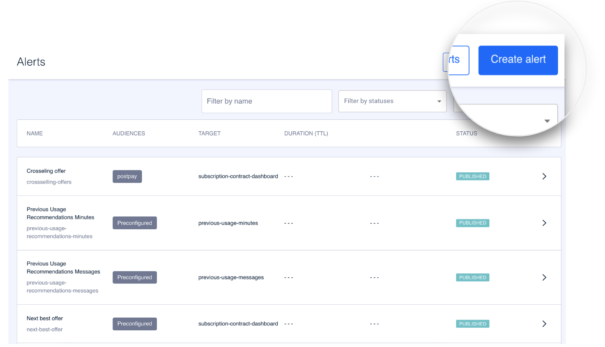

How to create an alert
======================

Click **Create alert** to create an alert. 

The process of creating an alert is divided into several steps:

**Step 1. Overview**. In this step you can configure the general information of the list (Internal name, ID, etc.).


overview.md


**Step 2. Content**. All alert details are configured here.


contenido.md


**Step 3. Preview**. The last step serves as a summary. From the Preview step, you can [create a test](../como-hacer-un-test.md) to validate the configuration before impacting a large mass of customers.


vista-previa.md


