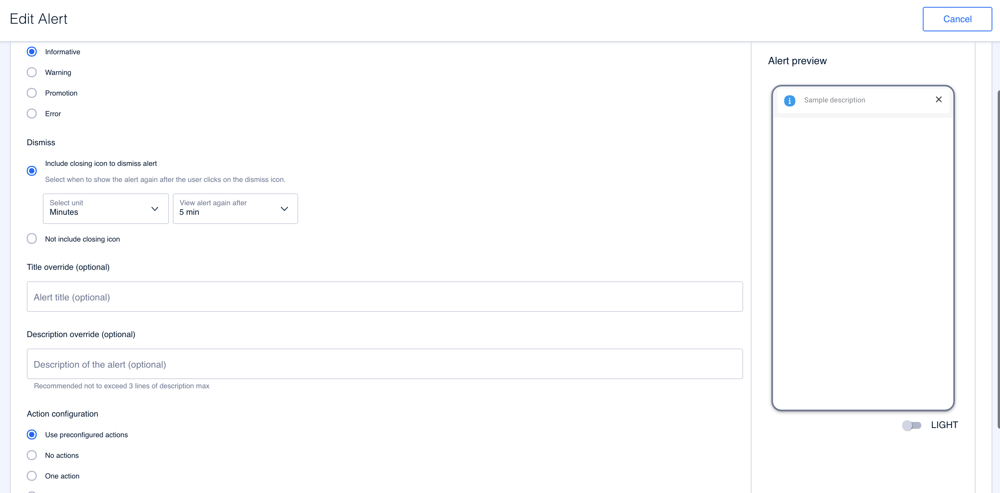
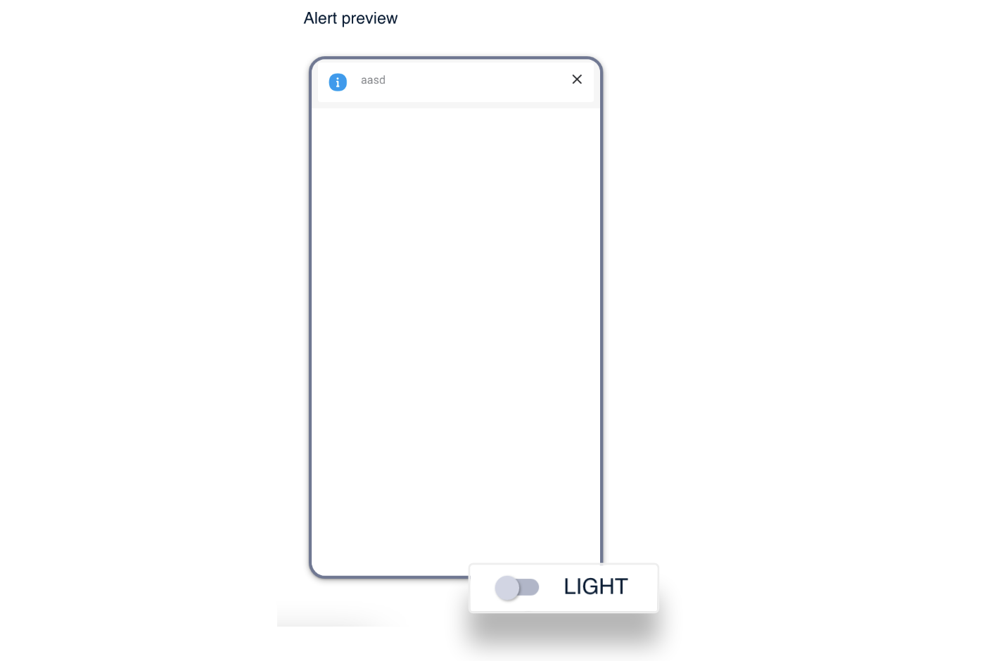

Content
=======

Use this step to configure the content of the alert.

### Content

Fill in the required fields:

**Type of alert**. Select the type of alert.

* **Informative**. Use this type of alert to provide information to the user. 
* **Warning**. Use this type of alert to warn the user and draw their attention, for example, to actions that require them to do something. 
* **Promotion**. Use this type of alert to show promotions to the user.
* **Error**. Use this type of alert to display some kind of error to the user. 


The icons displayed with each type of alert are not configurable. You can use the preview on the right side to see, roughly, how the alert will be displayed to the user.


**Dismiss**. Use the options to configure whether or not the alert can be closed by the user.

* **Include closing icon to dismiss alert**. Select this option to allow the user to close the alert. 


Alerts can only remain closed for a maximum of 1 year. Once this time has elapsed, the alert is displayed to the user again unless the alert is paused.


In the **Select unit** drop-down menu, indicate how much time will elapse before the alert is displayed again, taking into account that the maximum time is 12 months.

* **Not include closing icon**. Select this option if you don't want the user to be able to close the alert. This implies that the user will have to consume the alert and do whatever the alert indicates in order for it to disappear.  
  For example, an alert indicating that the user has no balance will not disappear until the balance is topped up.

**Title \(optional\)**. Title of the alert. This is an optional field. 

**Description**. Description of the alert. This is the text explaining why the alert is displayed to the user.


If you have configured an alert as *Preconfigured* in the previous step, please note that this alert may contain a title and must contain a description.

If, in step 2, you fill in the **Title** field and/or the **Description** field then the information that the alert could contain is replaced by what you enter for those fields.


**Action configuration**. Indicate whether the alert, in addition to a description, contains a navigation link:

* **No actions**. The alert does not contain any links.
* **One action**. The alert contains a link. For this link you need to configure: 
  * **Link text action**. The text that is displayed on the screen and which contains the associated link.
  * **Action navigation to**. Select **URL** to configure an external URL or select **Pre-configured** to select a URL from the available ones.

**Audiences**. Select an audience if you want the alert to be shown only to certain users who meet the conditions of that audience. This is an optional field. If you don't select anything, the alert will be shown to all users who meet the conditions for the alert to be shown to them.

### Alert preview

Use the preview to get an idea of how the user will see the alert when it appears on their device.

Click **LIGHT** to switch to **DARK** mode and vice-versa to preview how the alert will look when the user is in dark mode.

Click on **Continue** to proceed to the next step.

