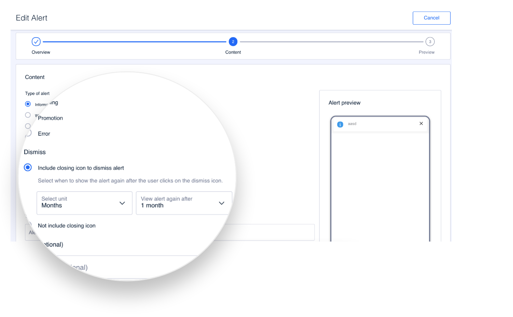

# Contenido

Usa este paso para configurar el contenido de la alerta.

### Content

Rellena los campos necesarios:

**Type of alert**. Selecciona de qué tipo es la alerta.

* **Informative**. Usa este tipo de alerta para proporcionar información al usuario.&#x20;
* **Warning**. Usa este tipo de alerta para advertir al usuario y llamar su atención, por ejemplo, sobre acciones que requieran de una acción por su parte.&#x20;
* **Promotion**. Usa este tipo de alerta para mostrar promociones al usuario.
* **Error**. Usa este tipo de alerta para mostrar algún tipo de error al usuario.&#x20;


Los iconos que se muestran con cada tipo de alerta no son configurables. Puedes usar la previsualización de la parte derecha para ver, de forma aproximada, cómo se mostrará la alerta al usuario.


**Dismiss**. Usa las opciones para configurar si la alerta puede o no cerrarse por el usuario.

* **Include closing icon to dismiss alert**. Selecciona esta opción para permitir al usuario cerrar la alerta.&#x20;


Las alertas solo pueden permanecer cerradas un máximo de 1 año. Pasado ese tiempo la alerta se vuelve a mostrar al usuario a menos que la alerta esté pausada.


Indica en el desplegable **Select unit** cuánto tiempo va a transcurrir hasta que se muestre la alerta de nuevo, teniendo en cuenta que el tiempo máximo es de 12 meses.

* **Not include closing icono**. Selecciona esta opción para que la alerta no pueda cerrarse por el usuario. Esto implica que el usuario tendrá que consumir la alerta obligatoriamente y hacer lo que indique la alerta para que desaparezca.\
  Por ejemplo, una alerta que indique al usuario que no tiene saldo no desaparecerá hasta que vuelva a tener saldo.

**Title (optional)**. Título de la alerta. Es un campo opcional.&#x20;

**Description**. Descripción de la alerta. Es el texto que explica por qué se muestra la alerta al usuario.


Si has configurado una alerta como _Preconfigured_ en el paso anterior ten en cuenta que esa alerta puede contener un título y contiene obligatoriamente una descripción.

Si en este paso 2 rellenas el campo **Title** y/o el campo **Description** entonces la información que pudiera contener la alerta se sustituye por la que indiques para esos campos.


**Action configuration**. Indica si la alerta, además de una descripción, lleva algún enlace de navegación:

* **No actions**. La alerta no contiene ninguna enlace.
* **One action**. La alerta contiene un enlace. Para ese enlace configura:
  * **Link text actio**n. En texto que se muestra en pantalla y que lleva el enlace asociado.
  * **Action navigation to**. Selecciona **URL** para configurar una URL externa o selecciona **Preconfigured** para seleccionar una URL de las disponibles.

**Audiences**. Selecciona una audiencia si quieres que la alerta se muestre solo a determinados usuarios que cumplan las condiciones de esa audiencia. Es un campo opcional. Si no seleccionas nada entonces la alerta se muestra a todos los usuarios que cumplan las premisas para que esa alerta se les muestre.

### Alert preview

Utiliza la preview para hacerte una idea de cómo verá el usuario la alerta cuando le aparezca en su dispositivo.

Usa el selector **LIGHT** para cambiar a modo **DARK** y viceversa y poder previsualizar como se ve la alerta cuando el usuario tiene el modo oscuro.

Haz clic en **Continue** para pasar al siguiente paso.
