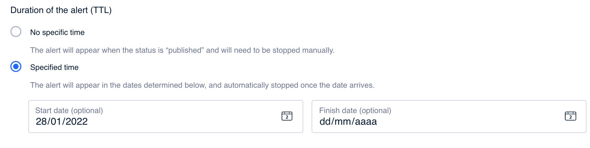

# Vista previa

En este último paso dispones de un resumen la alerta que has configurado. Y es también el lugar en el que puedes configurar la vigencia de la alerta.

Además, puedes iniciar un test para probar el contenido antes de impactar a los usuarios.

### Summary

Obtén un resumen sobre la alerta que has creado:

* **Type of alert**. Tipo de alerta que has creado: informativa, de advertencia, promocional o de error.&#x20;
* **Dismiss**. Indica si la alerta se ha configurado para ser cerrada o no.
* **Title**. Muestra el título de la alerta. \
  👋🏻 En el caso de alertas preconfiguradas no es posible mostrar el título y se indica _Preconfigured title_ como valor de este campo.
* **Description**. Muestra la descripción de la alerta.\
  👋🏻 En el caso de alertas preconfiguradas no es posible mostrar la descripción y se indica _Preconfigured description_ como valor de este campo.
* **Action configuration**. Si has configurado una o dos acciones aparecen los textos de los enlaces.\
  👋🏻 En el caso de alertas preconfiguradas no es posible mostrar la descripción y se indica _Preconfigured description_ como valor de este campo.\

### Duration of the alert

En este apartado configura, si es necesario, el tiempo en el que la alerta estará vigente.

* **No specific time**. Selecciona esta opción si no quieres configurar una vigencia concreta para la alerta. Con esta opción la alerta aparecerá al usuario si la audiencia que tiene configurada le aplica y si la alerta está Publicada.
* **Specific time**. Selecciona esta opción para indicar la fecha de comienzo y/o la fecha de fin. En este caso la alerta se mostrará al usuario solo en ese intervalo de tiempo y siempre y cuando al usuario le aplique la audiencia que tiene configurada la alerta y además esté Publicada.

Haz clic en **Save** para guardar los campos o haz clic en **Save and Publish** para guardar y publicar los cambios.

### Create test preview (optional)

Desde este último paso puedes también crear un test para probar el contenido que has configurado antes de impactar a una amplia masa de usuarios.&#x20;


🤓 Este paso es opcional aunque es muy recomendable que antes de publicar un contenido lo puedas probar antes.


En el campo **User ID (optional)** añade uno o más user IDs, separados únicamente por comas (sin espacios), en los que quieras hacer las pruebas. Haz clic en **Create test** para comenzar el test y poder probar el contenido.


**Cómo obtener el user ID**

1. Asegúrate de tener descargada la versión Enterprise de la app.
2. Abre la app
3. Agita el teléfono
4. Accede a la sección "Autentication"
5. el número que necesitas es el del campo **User ID**


¿Necesitas más información sobre cómo probar el contenido? 👇🏼


[como-hacer-un-test.md](../como-hacer-un-test.md)

