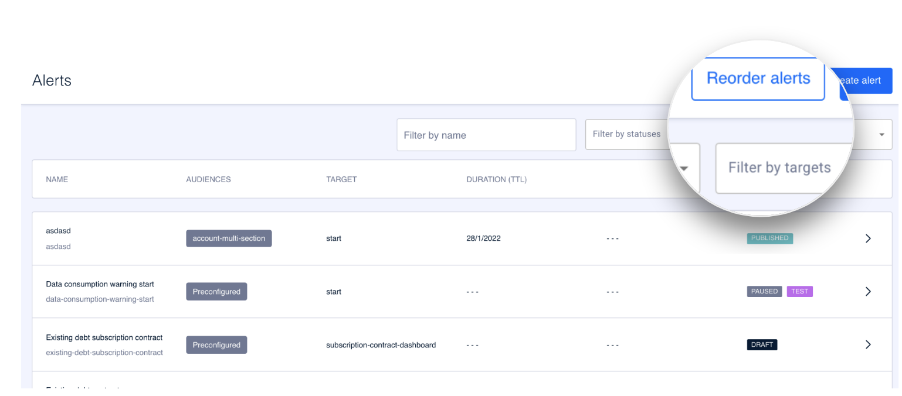

# Cómo reordenar alertas

El orden en el que se muestran las alertas es realmente importante. El orden de las alertas se configura desde la pantalla inicial. Haz clic en **Reorder alerts** para modificar el orden de las alertas.

**Select target**. Selecciona en el desplegable el target para el que vas a ordenar las alertas.&#x20;

Configura el orden de las alertas simplemente arrastrándolas y moviéndolas al orden correcto (drag\&drop). Ten en cuenta que el orden es de arriba abajo, es decir, la que esté en primera posición (más arriba) será la alerta que antes se muestre al usuario.&#x20;

Obviamente al usuario se le muestra la primera alerta que le aplique, es decir, hay que tener en cuenta que las alertas se configuran por audiencia y por tanto se mostrará al usuario la primera alerta que le corresponda.

Haz clic en **Save order** para guardar el nuevo orden o haz clic en **Cancel** para descartarlo.


En la pantalla principal de alertas aparecen todas las alertas creadas independientemente del target al que pertenezcan. Por eso el proceso de ordenación de alertas está relacionado con un target concreto y el orden de la pantalla principal no tiene por qué ser el orden real.

